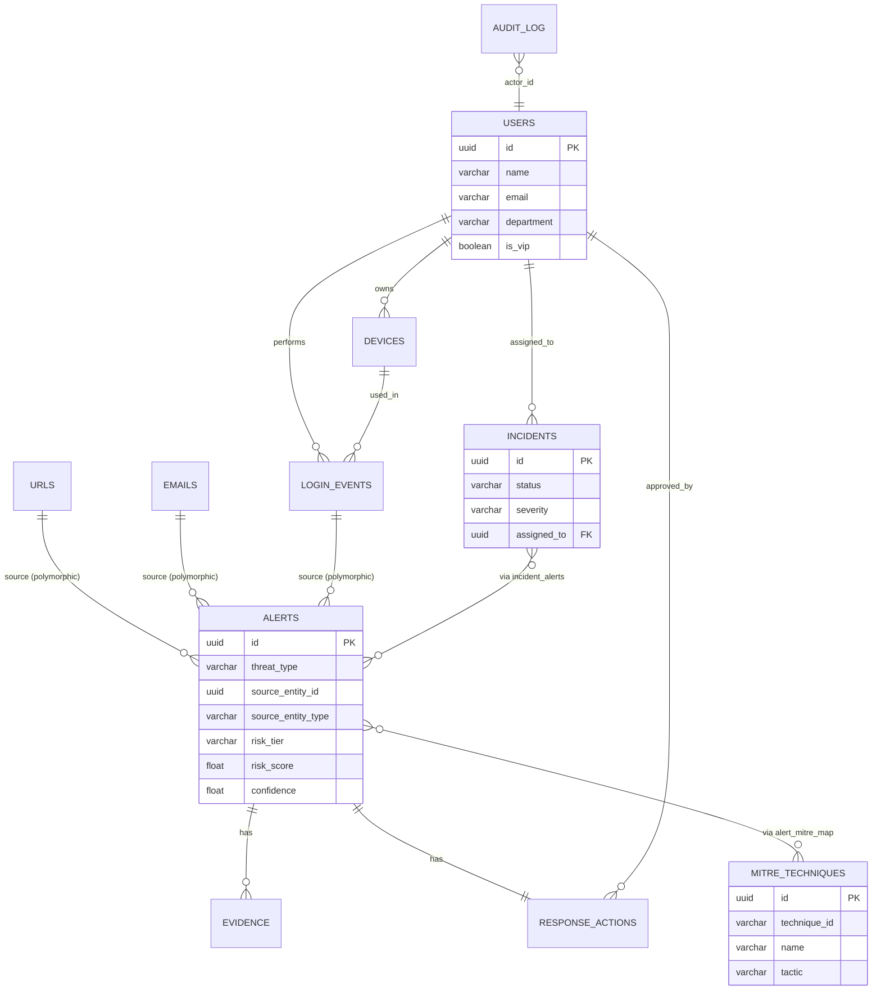

# Architecture

# CYBERGUARD — Architecture Design Document

**Version:** 1.0 · **Status:** Draft — pending Phase 2 approval · **Date:** 2026-09-13
**Depends on:** PRD.md v1.0 (approved) · Phase 0 Tech Stack Recommendation + Reanalysis (approved)
**Confirmed stack used throughout:** Frontend — React + TypeScript · Backend — FastAPI (Python) · Database — PostgreSQL · ML/Detection — scikit-learn + existing PhishMind (as-is) · Deployment — Docker Compose

---

## 1. Architecture Overview

CyberGuard is built as a **modular monolith**: one FastAPI backend service, with clean internal module boundaries per detection engine and reasoning stage, serving one React + TypeScript single-page frontend, backed by one PostgreSQL database.

**[CONFIRMED — Blueprint §7.1, Execution Plan §16, legacy ARCHITECTURE.md]** Microservices are intentionally rejected for this project. Reasoning, carried forward unchanged from source material:

- **Team size:** ~3–5 members. Service discovery, inter-service contracts, and distributed debugging overhead would consume days better spent on the fusion/explanation layer that is the actual product differentiator.
- **Hackathon timeline:** 3–4 weeks total. A microservices split multiplies the number of things that must work simultaneously for a demo to succeed — each service boundary is a new failure mode.
- **Operational overhead:** message queues, service meshes, and per-service deployment pipelines are infrastructure investments this project does not need to make its point.
- **Debugging:** a single process with clean module boundaries is debuggable with normal tooling (breakpoints, logs) across the whole request lifecycle — a stack trace crossing three network hops is not.
- **Deployment simplicity:** one Docker Compose file with three services (frontend, backend, database) is the entire deployment surface, directly satisfying the offline-demo requirement.

Internal module boundaries (Section 5) still exist and are enforced by code organization, not by network calls — this preserves the architectural story ("here's our pipeline") without the infra tax.

---

## 2. Architecture Principles

1. **Modularity** — each detection engine, and each pipeline stage (ingestion, fusion, XAI, MITRE, response), is a separate internal module with a defined input/output contract, even though all run in one process.
2. **Separation of concerns** — detection logic never talks to the database directly; detection engines return signal scores, the orchestration layer persists results.
3. **Common alert contract** — all three detection flows converge on one alert shape (Section 10, PRD §12/Execution Plan §20). No engine invents its own response format.
4. **Offline-first resilience** — every external dependency (threat-intel APIs) has a local fallback; the system must run and demo with zero internet access.
5. **Explainability by construction** — every alert carries evidence and MITRE tags as first-class fields, not optional metadata bolted on after scoring.
6. **Human-in-the-loop** — no code path executes a destructive action without a recorded human approval step.
7. **Secure-by-default** — input validation, SSRF protection, and auth are treated as baseline requirements of a security product, not hardening applied later.
8. **Measurable AI** — every detection component has a defined evaluation metric (PRD §25); no unmeasured claim is treated as a system property.
9. **Deterministic orchestration** — the pipeline order (detect → enrich → fuse → explain → map → recommend) is fixed and identical across all three scenarios; only the detection engine invoked and the fusion weights vary.
10. **Minimal infrastructure** — Postgres, one backend process, one frontend build. No message queue, no cache server, no service mesh for MVP.

---

## 3. High-Level Architecture Diagram

```
                         USER / SOC ANALYST
                                 │
                                 ▼
                  FRONTEND — React + TypeScript (SPA)
                                 │  REST (JSON, JWT-authenticated)
                                 ▼
                  BACKEND API — FastAPI (Python, single process)
                                 │
                                 ▼
                   INGESTION / NORMALIZATION
        (URL resolution, punycode decode, redirect-chain
         cap, .eml parsing, login-event feature extraction)
                                 │
             ┌───────────────────┼────────────────────┐
             ▼                   ▼                     ▼
    ┌────────────────┐  ┌────────────────┐   ┌──────────────────┐
    │ PHISHING ENGINE │  │ IMPERSONATION  │   │ ATO / BEHAVIOR    │
    │ (PhishMind +    │  │ ENGINE         │   │ ENGINE            │
    │  heuristics)    │  │ (domain sim +  │   │ (rules +          │
    │                 │  │  stylometry +  │   │  IsolationForest) │
    │                 │  │  sender-auth)  │   │                   │
    └────────┬────────┘  └───────┬────────┘   └─────────┬─────────┘
             │                   │                       │
             └───────────────────┼───────────────────────┘
                                 ▼
                    THREAT INTELLIGENCE ORCHESTRATOR
              ┌───────────────┬────────────────┬─────────────┐
              │ VirusTotal    │ URLhaus        │ AbuseIPDB    │
              │ Adapter       │ Adapter        │ Adapter      │
              └───────┬───────┴────────┬───────┴──────┬───────┘
                      └────────────────┼───────────────┘
                                       ▼
                          LOCAL CACHE / FALLBACK ADAPTER
                                       │
                                       ▼
                            RISK FUSION ENGINE
                  (per-threat-type weighted combination)
                                       │
                        ┌──────────────┴──────────────┐
                        ▼                             ▼
                 RISK SCORE + TIER              CONFIDENCE SCORE
                        │                             │
                        └──────────────┬──────────────┘
                                       ▼
                          XAI / EVIDENCE ENGINE
                                       │
                                       ▼
                          MITRE ATT&CK MAPPER
                                       │
                                       ▼
                          RESPONSE RECOMMENDER
                                       │
                                       ▼
                          HUMAN APPROVAL GATE
                        (Approve / Dismiss / Escalate)
                                       │
                                       ▼
                            INCIDENT STATE
                                       │
                                       ▼
                     DATABASE — PostgreSQL (persistence)
                                       │
                                       ▼
                    (rendered back through the API to the
                     React frontend — Dashboard / Alerts /
                     Incidents / Incident Detail)
```

External TI APIs are shown as adapters behind an orchestrator specifically so that the fusion engine never talks to VirusTotal/URLhaus/AbuseIPDB directly — it only ever sees a normalized `ti_score` plus a completeness flag, regardless of whether that came from a live call or the local cache.

---

## 4. Component Architecture

| Component | Responsibility | Inputs | Outputs | Failure behavior |
| --- | --- | --- | --- | --- |
| API Layer | HTTP routing, request validation, auth enforcement | HTTP requests | HTTP responses (JSON) | Returns structured 4xx on validation failure; never crashes the process on bad input |
| Ingestion | Parse and normalize raw submissions (URL, .eml, identity fields, login event) | Raw submission | Normalized entity (resolved URL, parsed headers, feature vector) | Rejects malformed input (FR-028) before it reaches detection |
| Normalization | Shortener resolution, punycode decode, redirect-chain following (capped) | Raw URL | Final resolved URL + redirect chain metadata | Caps hops to prevent infinite loops; times out gracefully, flags incomplete resolution |
| Phishing Engine | Score a URL/email for phishing likelihood | Normalized URL/email | `ml_score`, heuristic hits | If PhishMind model artifact fails to load, engine returns an explicit "unavailable" signal rather than a fabricated score, and confidence is capped |
| Impersonation Engine | Score sender/message/domain for impersonation | Sender, message, org | domain-similarity, stylometry, sender-auth scores | Missing known-org domain list degrades gracefully to a lower-confidence result, not a failure |
| ATO/Behavior Engine | Score a login event for anomaly/takeover risk | Login event fields | rule-hit score, Isolation Forest anomaly score | Missing non-required fields (e.g., RTT) reduces feature completeness, reflected in confidence |
| Threat Intelligence | Enrich with external reputation data, with fallback | Domain/URL/IP | `ti_score`, `data_completeness_note` | On timeout/rate-limit/network failure, falls back to local cache automatically |
| Risk Fusion | Combine per-engine signals into one score | Signal scores + weights | `fused_risk_score`, `risk_tier` | If a signal is missing, its weight is either redistributed or the gap is reflected in confidence — never silently treated as zero without a completeness note |
| XAI | Generate evidence array from signal outputs | Signal scores + rule hits | `evidence[]` | Never omits an evidence item silently; if a signal contributed to the score, it must appear in evidence |
| MITRE | Map threat pattern to technique(s) | `threat_type` + evidence pattern | `mitre[]` | If no mapping found, returns an empty array with an explicit "no mapping" indicator, not a fabricated technique |
| Response | Recommend action(s) from a static playbook | `threat_type` + `risk_tier` | `recommended_action` | Falls back to the most conservative applicable action (e.g., "Flag for review") if no exact playbook entry matches |
| Incident Management | Aggregate alerts into incidents, track lifecycle | Alert(s) | Incident record + status | Concurrent approval attempts are serialized at the DB transaction level to avoid inconsistent state |
| Database | Persist all entities | ORM writes/reads | Rows | Connection failure surfaces as a 503 to the API layer, not a silent data loss |
| Authentication | Verify JWT, gate protected routes | Request + token | Authenticated principal or 401 | Expired/invalid tokens are rejected explicitly, not treated as anonymous access |
| Audit Logging | Record security-relevant actions | Action events | Log entries | Logging failure must not block the underlying action (log best-effort, action authoritative) — **[PROPOSED]**, not specified in source material |

---

## 5. Backend Module Structure

**[CONFIRMED direction — Execution Plan §17, adapted to the FastAPI/Python conventions confirmed in Phase 0]**

```
backend/
├── app/
│   ├── main.py                    # FastAPI app instantiation, router registration
│   ├── config.py                  # environment variable loading (settings via pydantic-settings)
│   │
│   ├── api/
│   │   ├── __init__.py
│   │   ├── deps.py                 # shared dependencies (auth, DB session)
│   │   ├── routes_analyze.py       # POST /api/v1/analyze/*
│   │   ├── routes_alerts.py        # GET /api/v1/alerts*
│   │   ├── routes_incidents.py     # GET/POST /api/v1/incidents*
│   │   └── routes_dashboard.py     # GET /api/v1/dashboard/summary
│   │
│   ├── ingestion/
│   │   ├── url_normalizer.py       # shortener resolution, punycode decode, redirect cap
│   │   ├── email_parser.py         # .eml header/body extraction
│   │   └── login_event_parser.py   # RBA-style feature extraction
│   │
│   ├── detection/
│   │   ├── phishing/
│   │   │   ├── phishmind_adapter.py   # loads and calls the existing PhishMind model artifact, unmodified
│   │   │   └── heuristics.py
│   │   ├── impersonation/
│   │   │   ├── domain_similarity.py
│   │   │   ├── stylometry.py
│   │   │   └── sender_auth.py
│   │   └── behavior/
│   │       ├── rules.py               # spraying, impossible-travel, new-device
│   │       └── isolation_forest.py    # scikit-learn model wrapper
│   │
│   ├── threat_intel/
│   │   ├── orchestrator.py         # tries live adapters, falls back to cache
│   │   ├── adapters/
│   │   │   ├── virustotal.py
│   │   │   ├── urlhaus.py
│   │   │   └── abuseipdb.py
│   │   └── local_cache.py          # pre-populated JSON snapshot + lookup
│   │
│   ├── risk/
│   │   ├── fusion.py                # per-threat-type weighted formula (PRD §13)
│   │   └── confidence.py            # signal-agreement + completeness scoring
│   │
│   ├── xai/
│   │   └── evidence_builder.py      # signal scores/rule hits → evidence[]
│   │
│   ├── mitre/
│   │   ├── technique_table.py       # curated 10–15 entry lookup table (data)
│   │   └── mapper.py                # threat_type/evidence pattern → technique_id(s)
│   │
│   ├── response/
│   │   └── playbook.py              # static JSON-backed action recommendation
│   │
│   ├── incidents/
│   │   ├── service.py               # alert→incident aggregation, lifecycle transitions
│   │   └── approval.py              # Approve/Dismiss/Escalate handling, audit hook
│   │
│   ├── db/
│   │   ├── models.py                # SQLAlchemy ORM models (Section 13)
│   │   ├── session.py               # engine/session factory
│   │   └── migrations/              # Alembic migration scripts — [OPEN DECISION: confirm Alembic, PRD §29 item 10]
│   │
│   ├── auth/
│   │   ├── jwt_handler.py
│   │   └── security.py
│   │
│   └── audit/
│       └── logger.py
│
├── tests/
│   ├── unit/
│   ├── integration/
│   └── adversarial/                 # homoglyph/punycode/redirect/shortener test suite (PRD §11 basis)
│
├── requirements.txt
├── Dockerfile
└── alembic.ini                      # if Alembic confirmed — see Open Decisions
```

This structure is derived directly from the Execution Plan §17 conceptual tree, made concrete in FastAPI/Python idioms (routers instead of a generic `api/` folder of unspecified shape, explicit adapter classes for each detection/TI source).

---

## 6. Frontend Architecture

**[CONFIRMED — Phase 0 reanalysis]** Framework: React + TypeScript. The application structure below re-expresses the **already-approved information architecture and component tree** from the Frontend Readiness Assessment (originally written in Angular terms) in React idioms — this is a translation of confirmed product/UX decisions, not a redesign.

### Application structure

```
frontend/
├── src/
│   ├── main.tsx
│   ├── App.tsx                      # router root
│   │
│   ├── routes/
│   │   ├── Dashboard.tsx
│   │   ├── UrlAnalyzer.tsx
│   │   ├── IdentityAnalyzer.tsx
│   │   ├── BehaviorAnalyzer.tsx
│   │   ├── Alerts.tsx
│   │   ├── Incidents.tsx
│   │   └── IncidentDetail.tsx
│   │
│   ├── components/
│   │   ├── shared/
│   │   │   ├── RiskBadge.tsx
│   │   │   ├── ConfidenceIndicator.tsx
│   │   │   ├── EvidenceList.tsx
│   │   │   ├── MitreBadge.tsx
│   │   │   ├── RecommendationCard.tsx
│   │   │   ├── ApprovalControl.tsx
│   │   │   ├── StatusBadge.tsx
│   │   │   ├── DataCompletenessNote.tsx
│   │   │   └── states/
│   │   │       ├── LoadingState.tsx
│   │   │       ├── ErrorState.tsx
│   │   │       └── EmptyState.tsx
│   │   ├── dashboard/
│   │   │   ├── AttentionBand.tsx
│   │   │   ├── SeverityTiles.tsx
│   │   │   ├── ScenarioCounters.tsx
│   │   │   ├── TimelineChart.tsx
│   │   │   └── RecentIncidentsList.tsx
│   │   ├── analyzer/
│   │   │   ├── AnalyzerForm.tsx      # shared base, parameterized per scenario
│   │   │   └── AnalyzerResult.tsx
│   │   ├── alerts/
│   │   │   ├── AlertFilters.tsx
│   │   │   └── AlertTable.tsx
│   │   ├── incidents/
│   │   │   ├── IncidentFilters.tsx
│   │   │   └── IncidentTable.tsx
│   │   └── incident-detail/
│   │       ├── ThreatHeader.tsx
│   │       └── DetectionSignalsBreakdown.tsx
│   │
│   ├── services/                    # replaces Angular's injectable services
│   │   ├── apiClient.ts             # fetch/axios wrapper, base URL, auth header injection
│   │   ├── alertService.ts
│   │   ├── incidentService.ts
│   │   └── dashboardService.ts
│   │
│   ├── hooks/
│   │   ├── useAlerts.ts             # TanStack Query wrapper around alertService
│   │   ├── useIncidents.ts
│   │   ├── useDashboardSummary.ts
│   │   └── useAuth.ts
│   │
│   ├── types/
│   │   └── alert.ts                 # Alert, Incident, DashboardSummary interfaces — ported verbatim from Frontend Readiness Assessment §8
│   │
│   ├── mocks/
│   │   └── mock-data.ts             # fixtures matching Alert/Incident/DashboardSummary exactly (10 cases per Frontend Readiness Assessment §10)
│   │
│   └── layout/
│       ├── TopNav.tsx
│       └── SideNav.tsx
│
├── package.json
├── tsconfig.json
├── Dockerfile
└── vite.config.ts                    # [PROPOSED] build tool — see Open Decisions
```

### State management approach

**[PROPOSED — PRD §29 item 9, explicitly left open at Phase 0]** Server state (alerts, incidents, dashboard data) is managed via TanStack Query (React Query), matching the "thin service layer that swaps mock-to-HTTP with zero component changes" pattern already specified in the Frontend Readiness Assessment §10 — `AlertService`/`IncidentService`/`DashboardService` become `alertService.ts`/`incidentService.ts`/`dashboardService.ts` consumed through `useAlerts`/`useIncidents`/`useDashboardSummary` hooks. Local UI state (form inputs, approval-control selection) uses React's built-in `useState`. No global client-state library (Redux/Zustand) is confirmed as necessary — the app has no cross-cutting client state beyond auth token, which can live in a small `useAuth` context. If a real need for shared client state emerges, this is a Phase 3+ (implementation) decision, not one to pre-commit here.

### API client strategy

One `apiClient.ts` wraps `fetch`, attaches the JWT bearer token, and centralizes base-URL configuration (via environment variable, Section 22). Per-domain services (`alertService`, `incidentService`, `dashboardService`) call `apiClient` and return typed data matching `types/alert.ts` — this exactly preserves the "components only ever depend on the service interface" rule from the Frontend Readiness Assessment §10, so swapping mock fixtures for live HTTP calls requires zero component changes.

### Loading/error/empty states

Every screen identified in PRD §18 renders one of `LoadingState`, `ErrorState`, or `EmptyState` from `components/shared/states/` while data is pending, failed, or absent — consistent with the Frontend Readiness Assessment §5/§7's shared-component list, and directly satisfying PRD §18's per-screen state requirements.

### Screen-to-component mapping

| Screen (PRD §18) | Primary route file | Key components used |
| --- | --- | --- |
| Dashboard | `routes/Dashboard.tsx` | AttentionBand, SeverityTiles, ScenarioCounters, TimelineChart, RecentIncidentsList |
| URL Analyzer | `routes/UrlAnalyzer.tsx` | AnalyzerForm, AnalyzerResult (+ RiskBadge, EvidenceList, MitreBadge, RecommendationCard) |
| Identity Analyzer | `routes/IdentityAnalyzer.tsx` | Same shared analyzer primitives |
| Behavior Analyzer | `routes/BehaviorAnalyzer.tsx` | Same shared analyzer primitives |
| Alerts | `routes/Alerts.tsx` | AlertFilters, AlertTable |
| Incidents | `routes/Incidents.tsx` | IncidentFilters, IncidentTable |
| Incident Detail | `routes/IncidentDetail.tsx` | ThreatHeader, RiskBadge, ConfidenceIndicator, EvidenceList, DetectionSignalsBreakdown, MitreBadge(s), RecommendationCard, ApprovalControl, StatusBadge |

---

## 7. Detection Engine Architecture

### Phishing

```
Normalized URL/email
        ↓
Feature extraction (lexical, structural — length, subdomain count,
suspicious tokens, entropy, HTTPS, punycode-decoded string)
        ↓
PhishMind (existing trained model — BiLSTM+CNN+TF-IDF+heuristics → Random Forest)
        ↓
Heuristic layer (domain age, TLD reputation, urgency keywords)
        ↓
ml_score, heuristic_score  →  passed to Threat Intelligence, then Risk Fusion
```

**[CONFIRMED]** PhishMind is loaded and called as an existing trained artifact. It is not retrained, fine-tuned, or re-platformed as part of this project (PRD §5, §27).

### Impersonation

```
Sender / message / claimed organization
        ↓
Domain similarity (Levenshtein / lookalike check vs. known-org domain list)
        ↓
Sender authenticity heuristic (SPF/DKIM-style mismatch simulation)
        ↓
Stylometric similarity (TF-IDF-style comparison vs. known-contact corpus)
        ↓
domain_similarity_score, sender_auth_score, stylometry_score → identity_score → Risk Fusion
```

No trained classifier is used here — this is explicitly rule/similarity-based per PRD §11 Scenario 2, matching the Blueprint's stated rationale (near-zero compute, fully explainable, low live-demo risk).

### ATO / Behavior

```
Login event (device, geo, timestamp, success/fail, RTT)
        ↓
Feature extraction (RBA-style: device fingerprint match, geo-velocity,
time-of-day, failure count in window)
        ↓
Rule engine (impossible travel, password spraying, new device) → rule_hit_score
        ↓
IsolationForest (scikit-learn, fit on RBA dataset subset) → anomaly_score
        ↓
rule_hit_score, anomaly_score → Risk Fusion
```

**[CONFIRMED]** `IsolationForest` is the confirmed anomaly-detection approach (Phase 0). No claim is made that any model is production-calibrated beyond what evaluation (PRD §25) actually measures.

---

## 8. Threat Intelligence Architecture

```
                 TI ORCHESTRATOR
                        │
        ┌───────────────┼────────────────┐
        ▼               ▼                ▼
  VirusTotal        URLhaus         AbuseIPDB
   Adapter           Adapter         Adapter
   (4/min,          (no key         (1000/day
   500/day)         required)        free tier)
        │               │                │
        └───────────────┼────────────────┘
                        ▼
              Live result aggregation
              (score = 0 clean/unknown,
               0.5 one feed hit,
               1.0 two+ feeds or known-malicious)
                        │
              ┌─────────┴─────────┐
              ▼                   ▼
      SUCCESS (live)      FAILURE / TIMEOUT / RATE-LIMIT
              │                   │
              │                   ▼
              │          LOCAL CACHE ADAPTER
              │        (pre-populated JSON snapshot
              │         of known-bad/known-good
              │         domains/IPs/hashes)
              │                   │
              └─────────┬─────────┘
                        ▼
              ti_score + data_completeness_note
                        │
                        ▼
                  RISK FUSION
```

**Timeouts:** **[OPEN DECISION — PRD §29 item 5]** exact timeout value not specified in source documents. Proposed default for Architecture purposes: 2 seconds per live adapter call, after which the orchestrator treats that adapter as failed and proceeds (either to another adapter or to cache) — this keeps total enrichment time compatible with the `[PROPOSED TARGET]` end-to-end latency in PRD §20. This value is a **[PROPOSED]** starting point, not confirmed.

**Caching:** the local cache is a static JSON file/table pre-populated before the demo with known-bad/known-good indicators, refreshed manually by the team, not a live write-through cache of API responses (no confirmed requirement for cache warming from live traffic).

**Error isolation:** a failure in one TI adapter (e.g., VirusTotal rate-limited) does not block the others — the orchestrator queries adapters independently and aggregates whatever succeeds, falling back to cache only for the specific signal that failed.

**Data completeness:** every alert's `data_completeness_note` field states plainly whether enrichment was live, partially degraded, or fully cached.

---

## 9. Risk Fusion Architecture

**[CONFIRMED — PRD §13, Blueprint §8]** Per-engine signals are normalized to `[0,1]` and combined via a threat-type-specific weighted sum:

```
Phishing URL/Email:  fused_risk = 0.5·ml_score + 0.2·heuristic_score + 0.3·ti_score
Impersonation:       fused_risk = 0.2·ml_score + 0.2·heuristic_score + 0.1·ti_score + 0.5·identity_score
ATO:                 fused_risk = 0.6·anomaly_score + 0.4·rule_hit_score
```

`risk_tier` is then assigned from the fixed five-tier scale (PRD §13).

**Confidence** is computed separately — `[PROPOSED formula, per Blueprint §8]`:

```
confidence_raw = 1 − stdev(normalized component scores)
confidence = confidence_raw, capped downward if:
  - threat-intel fallback (cache) was used, OR
  - any expected signal/feature was missing from the input
```

**Status of these formulas:** `[CONFIRMED design, PROVISIONAL values]` — the weights above are the ones stated in source documents and are explicitly labeled there as "tunable per threat type — a design decision to defend, not a fixed universal constant" (Blueprint §8). This architecture document implements them as configuration (not hardcoded magic numbers) specifically so they can be revisited after evaluation (PRD §25) without a code change. **Future calibration** against a labeled validation set is an explicit Future item (PRD §20 Scalability, Blueprint §16 Q28/§15 Q48), not attempted in MVP.

---

## 10. XAI Architecture

Every alert produces an evidence array where each item retains:

```json
{ "signal": "ml_model | heuristic | threat_intel | identity", "text": "human-readable sentence" }
```

**Provenance rule:** if a signal contributed non-trivially to the fused risk score, it must appear in `evidence[]` — the XAI module is driven directly off the same signal scores the fusion engine consumed, not a separately-authored explanation (this prevents the evidence text and the actual score drivers from silently drifting apart).

**Full alert output shape (canonical, PRD §12/Execution Plan §20):**

```json
{
  "alert_id": "string",
  "threat_type": "phishing_url | phishing_email | impersonation | account_takeover",
  "risk_tier": "Safe | Low | Medium | High | Critical",
  "risk_score": 0.0,
  "confidence": 0.0,
  "evidence": [
    { "signal": "ml_model", "text": "..." }
  ],
  "mitre": [
    { "technique_id": "T1566.002", "name": "Spearphishing Link", "tactic": "Initial Access" }
  ],
  "recommended_action": {
    "primary": "Block URL",
    "secondary": ["Notify affected user"],
    "requires_human_approval": true
  },
  "data_completeness_note": "string",
  "source_entity_id": "string",
  "source_entity_type": "url | email | login_event",
  "created_at": "ISO-8601 timestamp"
}
```

This reconciles the two slightly different example shapes in source material (Blueprint §9 uses `fused_risk_score` and `confidence: "High"` as a string tier; Execution Plan §20 uses `risk_score` as a number and `confidence` as a number). **Resolution [PROPOSED, needs team sign-off]:** `risk_score` (numeric, matches Execution Plan naming) and `confidence` (numeric 0–1, with the UI layer responsible for rendering a Low/Medium/High label) are used as the canonical field names going forward, since numeric confidence is strictly more informative than a pre-bucketed string and can always be displayed as a tier client-side. This is flagged here as a naming decision the team should confirm, not silently adjudicated as fact.

---

## 11. MITRE Architecture

MITRE is enrichment, not a system of its own. **[CONFIRMED — Blueprint §5.5/§11, Execution Plan §11]**

```
threat_type + evidence pattern
        ↓
Static keyword/rule lookup table (Python dict or small DB table)
        ↓
technique_id + name + tactic
```

Approximately 10–15 mappings for MVP (PRD §12 FR-016, Blueprint §12). **Only one mapping is confirmed by source material** (T1566.002 — Spearphishing Link, Blueprint §9 worked example). The remainder of the table is an **[OPEN DECISION — BACKEND CONTRACT REQUIRED, PRD §29 item 3]** that must be authored before Incident Detail screens can render real (non-mock) MITRE tags for impersonation and ATO scenarios. Example candidate entries for the impersonation/ATO scenarios (T1078 Valid Accounts, T1110.003 Password Spraying) appear in PRD §11 as illustrative, not as a confirmed final table.

No embedding-based or ML-driven MITRE mapping is used — explicitly rejected as over-engineering relative to payoff at this scale (Blueprint §5.5).

---

## 12. Response Architecture

```
Recommendation (primary + secondary actions, from static playbook)
        ↓
requires_human_approval field (always true for Block/Quarantine/Revoke)
        ↓
Analyst selects: Approve | Dismiss | Escalate
        ↓
Audit log entry written (actor, action, target, timestamp)
        ↓
Incident state transition (Section 17 lifecycle, PRD §17)
```

**No uncontrolled destructive automation** — this is a hard architectural constraint, not a UI convention. The API layer rejects any code path that would transition an incident to `Contained` without a preceding recorded approval action (FR-018). No component of the system is permitted to call an external system to actually block a URL, quarantine an email, or revoke a session in the MVP — these are recorded state transitions on synthetic demo data, per PRD §16/§22.

---

## 13. Core Data Model

**[CONFIRMED entity list — Blueprint §7.3, Execution Plan §19]**

### `users`

| Field | Type | Required | Key | Description |
| --- | --- | --- | --- | --- |
| id | UUID | Yes | PK |  |
| name | VARCHAR | Yes |  |  |
| email | VARCHAR | Yes | Unique |  |
| department | VARCHAR | No |  |  |
| is_vip | BOOLEAN | No |  | Default false |
| created_at | TIMESTAMP | Yes |  |  |

### `devices`

| Field | Type | Required | Key | Description |
| --- | --- | --- | --- | --- |
| id | UUID | Yes | PK |  |
| user_id | UUID | Yes | FK → users.id |  |
| fingerprint | VARCHAR | Yes |  |  |
| first_seen | TIMESTAMP | Yes |  |  |
| last_seen | TIMESTAMP | Yes |  |  |
| is_trusted | BOOLEAN | No |  | Default false |

### `domains`

| Field | Type | Required | Key | Description |
| --- | --- | --- | --- | --- |
| id | UUID | Yes | PK |  |
| domain_name | VARCHAR | Yes | Unique |  |
| is_verified_org_domain | BOOLEAN | No |  | Used by impersonation engine |
| risk_score | FLOAT | No |  | Cached last-known score |
| last_checked | TIMESTAMP | No |  |  |

### `urls`

| Field | Type | Required | Key | Description |
| --- | --- | --- | --- | --- |
| id | UUID | Yes | PK |  |
| raw_url | TEXT | Yes |  | As submitted |
| resolved_url | TEXT | No |  | Post-normalization |
| redirect_chain_json | JSONB | No |  | List of hops |
| phishmind_score | FLOAT | No |  |  |
| threat_intel_json | JSONB | No |  | Raw TI adapter responses (debug/audit) |
| created_at | TIMESTAMP | Yes |  |  |

### `emails`

| Field | Type | Required | Key | Description |
| --- | --- | --- | --- | --- |
| id | UUID | Yes | PK |  |
| sender | VARCHAR | Yes |  |  |
| subject | VARCHAR | No |  |  |
| body_hash | VARCHAR | No |  | Store hash, not raw body, for privacy |
| spf_result | VARCHAR | No |  |  |
| dkim_result | VARCHAR | No |  |  |
| stylometry_score | FLOAT | No |  |  |
| created_at | TIMESTAMP | Yes |  |  |

### `login_events`

| Field | Type | Required | Key | Description |
| --- | --- | --- | --- | --- |
| id | UUID | Yes | PK |  |
| user_id | UUID | Yes | FK → users.id |  |
| device_id | UUID | No | FK → devices.id |  |
| ip_address | VARCHAR | Yes |  |  |
| geo_lat | FLOAT | No |  |  |
| geo_lon | FLOAT | No |  |  |
| rtt_ms | INTEGER | No |  | Missing → confidence penalty, not rejection |
| is_success | BOOLEAN | Yes |  |  |
| is_new_device | BOOLEAN | No |  |  |
| timestamp | TIMESTAMP | Yes |  |  |

### `alerts`

| Field | Type | Required | Key | Description |
| --- | --- | --- | --- | --- |
| id | UUID | Yes | PK | Exposed as `alert_id` in API |
| threat_type | VARCHAR | Yes |  | Enum: phishing_url, phishing_email, impersonation, account_takeover |
| source_entity_id | UUID | Yes |  | Polymorphic reference |
| source_entity_type | VARCHAR | Yes |  | 'url' | 'email' | 'login_event' |
| risk_tier | VARCHAR | Yes |  | Safe/Low/Medium/High/Critical |
| risk_score | FLOAT | Yes |  | 0–1, canonical name per Section 10 |
| confidence | FLOAT | Yes |  | 0–1, canonical name per Section 10 |
| ml_score | FLOAT | No |  | Component breakdown |
| heuristic_score | FLOAT | No |  | Component breakdown |
| threat_intel_score | FLOAT | No |  | Component breakdown |
| identity_score | FLOAT | No |  | Component breakdown (impersonation only) |
| data_completeness_note | TEXT | Yes |  |  |
| created_at | TIMESTAMP | Yes |  |  |

### `mitre_techniques`

| Field | Type | Required | Key | Description |
| --- | --- | --- | --- | --- |
| id | UUID | Yes | PK |  |
| technique_id | VARCHAR | Yes | Unique | e.g. "T1566.002" |
| name | VARCHAR | Yes |  |  |
| tactic | VARCHAR | Yes |  |  |
| description | TEXT | No |  |  |

### `alert_mitre_map` (join table)

| Field | Type | Required | Key | Description |
| --- | --- | --- | --- | --- |
| alert_id | UUID | Yes | FK → alerts.id |  |
| technique_id | UUID | Yes | FK → mitre_techniques.id |  |

### `incidents`

| Field | Type | Required | Key | Description |
| --- | --- | --- | --- | --- |
| id | UUID | Yes | PK |  |
| status | VARCHAR | Yes |  | Open/Contained/Dismissed/Escalated (PRD §17) |
| severity | VARCHAR | Yes |  | Mirrors highest-severity constituent alert |
| assigned_to | UUID | No | FK → users.id | `[PROPOSED]` — RBAC not finalized, PRD §29 item 1 |
| opened_at | TIMESTAMP | Yes |  |  |
| closed_at | TIMESTAMP | No |  |  |

### `incident_alerts` (join table)

**[PROPOSED — replaces Blueprint's `alert_ids_json` with an explicit join table]** per the task's instruction to use explicit join tables rather than vague JSON where M:M relationships exist, unless the existing project direction clearly requires JSON. The Blueprint's `alert_ids_json` column is a documented simplification; this architecture upgrades it to a proper join table since incident↔alert is a genuine M:M relationship and the join table costs nothing extra to implement correctly from the start.

| Field | Type | Required | Key | Description |
| --- | --- | --- | --- | --- |
| incident_id | UUID | Yes | FK → incidents.id |  |
| alert_id | UUID | Yes | FK → alerts.id |  |

### `evidence`

| Field | Type | Required | Key | Description |
| --- | --- | --- | --- | --- |
| id | UUID | Yes | PK |  |
| alert_id | UUID | Yes | FK → alerts.id |  |
| evidence_text | TEXT | Yes |  |  |
| signal | VARCHAR | Yes |  | ml_model / heuristic / threat_intel / identity |

### `response_actions`

| Field | Type | Required | Key | Description |
| --- | --- | --- | --- | --- |
| id | UUID | Yes | PK |  |
| alert_id | UUID | Yes | FK → alerts.id |  |
| recommended_action | VARCHAR | Yes |  | Primary action |
| secondary_actions_json | JSONB | No |  | Small, non-relational list — JSON acceptable here (not a queried relationship) |
| requires_human_approval | BOOLEAN | Yes |  |  |
| action_status | VARCHAR | Yes |  | Pending/Approved/Dismissed/Escalated |
| approved_by | UUID | No | FK → users.id |  |
| approved_at | TIMESTAMP | No |  |  |

### `threat_intelligence` (cache/audit table — distinct from live adapter calls)

**[PROPOSED — named in PRD §12 dependencies but not detailed in Blueprint's DDL]**

| Field | Type | Required | Key | Description |
| --- | --- | --- | --- | --- |
| id | UUID | Yes | PK |  |
| indicator | VARCHAR | Yes | Unique | domain/IP/hash |
| indicator_type | VARCHAR | Yes |  | domain / ip / hash |
| source | VARCHAR | Yes |  | virustotal / urlhaus / abuseipdb / local_cache |
| score | FLOAT | Yes |  | Normalized 0–1 |
| last_updated | TIMESTAMP | Yes |  |  |

### `audit_log`

**[PROPOSED — required by PRD FR-026, not detailed in Blueprint's DDL]**

| Field | Type | Required | Key | Description |
| --- | --- | --- | --- | --- |
| id | UUID | Yes | PK |  |
| actor_id | UUID | Yes | FK → users.id |  |
| action | VARCHAR | Yes |  | e.g. "approve", "dismiss", "escalate" |
| target_type | VARCHAR | Yes |  | "alert" | "incident" |
| target_id | UUID | Yes |  |  |
| timestamp | TIMESTAMP | Yes |  |  |

### Relationships summary

- `users` 1:M `devices`, 1:M `login_events`
- `alerts` M:1 `urls`/`emails`/`login_events` via polymorphic `source_entity_id`/`source_entity_type` (Blueprint's documented simplification, retained — Section 13 rationale below)
- `alerts` 1:M `evidence`
- `alerts` M:M `mitre_techniques` via `alert_mitre_map`
- `alerts` 1:1 `response_actions` (one recommendation per alert)
- `incidents` M:M `alerts` via `incident_alerts`
- `incidents` M:1 `users` via `assigned_to` (`[PROPOSED]`)

**Rejected alternative [CONFIRMED — Blueprint §7.3]:** fully normalized polymorphic association tables (separate junction tables per entity type instead of a type-tag column on `alerts`) — rejected as unnecessary complexity for a 3–4 week build; the type-tag column is a well-known, acceptable simplification at this scale, carried forward unchanged from the Blueprint.

---

## 14. Entity Relationship Diagram



**ASCII explanation:** An `alert` is generated from exactly one source entity (a URL, an email, or a login event) via the polymorphic `source_entity_id`/`source_entity_type` pair. Each alert accumulates zero or more `evidence` rows, is tagged with zero or more `mitre_techniques` through the join table, and has exactly one `response_actions` row (the recommendation for that alert). One or more `alerts` are aggregated into an `incident`, which may be `assigned_to` a user (role/permissions for that assignment are `[OPEN DECISION]`, Section 17). No entity beyond the ones listed in Section 13 is introduced.

---

## 15. API Architecture

**Base path:** `/api/v1`. **Authentication:** JWT bearer token on all routes except `/api/v1/auth/login`.

| Method | Path | Purpose | Auth | Request body | Response body | Errors |
| --- | --- | --- | --- | --- | --- | --- |
| POST | `/api/v1/auth/login` | Obtain JWT | None | `{ username, password }` | `{ access_token, token_type }` | 401 invalid credentials |
| POST | `/api/v1/analyze/url` | Run phishing pipeline on a URL | JWT | `{ url: string }` | `Alert` (Section 10 shape) | 400 invalid URL, 422 validation |
| POST | `/api/v1/analyze/email` | Run phishing/impersonation pipeline on an email | JWT | `{ eml_content: string }` or multipart file | `Alert` | 400 unparseable file, 413 too large |
| POST | `/api/v1/analyze/identity` | Run impersonation pipeline | JWT | `{ sender: string, message: string, claimed_organization: string }` | `Alert` | 422 missing fields |
| POST | `/api/v1/analyze/login-event` | Run ATO pipeline | JWT | `{ user_id, device_fingerprint, ip_address, geo_lat, geo_lon, rtt_ms?, is_success, timestamp }` | `Alert` | 422 missing required fields |
| GET | `/api/v1/alerts` | List/filter alerts | JWT | Query: `risk_tier?, threat_type?, date_from?, date_to?, page?, page_size?` | `{ items: Alert[], total, page }` | — |
| GET | `/api/v1/alerts/{id}` | Fetch one alert | JWT | — | `Alert` | 404 not found |
| GET | `/api/v1/incidents` | List incidents | JWT | Query: `status?, severity?, page?, page_size?` | `{ items: Incident[], total, page }` | — |
| GET | `/api/v1/incidents/{id}` | Fetch one incident with its alerts | JWT | — | `Incident` (embeds `alerts: Alert[]`) | 404 not found |
| POST | `/api/v1/incidents/{id}/approve` | Approve the recommended response | JWT | `{ notes?: string }` | Updated `Incident` | 404, 409 (already actioned) |
| POST | `/api/v1/incidents/{id}/dismiss` | Dismiss the recommended response | JWT | `{ notes?: string }` | Updated `Incident` | 404, 409 |
| POST | `/api/v1/incidents/{id}/escalate` | Escalate the incident | JWT | `{ notes?: string }` | Updated `Incident` | 404, 409 |
| GET | `/api/v1/dashboard/summary` | Aggregate dashboard data | JWT | — | `DashboardSummary` | — |
| GET | `/api/v1/mitre/techniques` | Static technique reference list | JWT | — | `MitreTechnique[]` | — |
| GET | `/api/v1/incidents/{id}/graph` | Attack-chain graph data | JWT | — | `{ nodes: [], edges: [] }` | 404 — **Stretch only**, not MVP |

### API Contract Decisions

This section directly resolves the naming conflicts flagged in the Frontend Readiness Assessment §9 and carried into PRD §29 items 2/4 as Open Decisions. Each conflict is resolved here, explicitly, rather than left ambiguous for implementation to guess at.

| # | Existing documented endpoint | Conflicting endpoint | Recommended canonical endpoint | Reason | Status |
| --- | --- | --- | --- | --- | --- |
| 1 | `/analyze/login` (Execution Plan §18) | `/analyze/login-event` (Blueprint §7.4) | **`/api/v1/analyze/login-event`** | More specific/descriptive; matches the `login_events` table name directly, reducing ambiguity with a hypothetical future generic "login" concept | Resolved — not an open decision |
| 2 | `/incidents/{id}/approve` + `/incidents/{id}/dismiss` (Execution Plan §18) | `/alerts/{id}/respond` (Blueprint §7.4) | **`/api/v1/incidents/{id}/approve`**, **`/dismiss`**, **`/escalate`** (three distinct verbs, on the incident, not the alert) | Approval is a lifecycle action on the *case* (incident), not on an individual detection event (alert) — an incident can aggregate multiple alerts, and the approval decision applies to the incident's overall recommended response. A single `/respond` endpoint would need a body parameter to distinguish approve/dismiss/escalate, which is less explicit and harder to authorize/audit per action type than three distinct routes. | Resolved — not an open decision |
| 3 | Not present in Blueprint §7.4 endpoint list (only `/incidents/{id}/graph` shown) | Frontend Readiness Assessment assumes a bare `GET /incidents/{id}` must exist | **`GET /api/v1/incidents/{id}`** confirmed as a canonical endpoint | Required by FR-024 (Incident Detail view) regardless of whether it was enumerated in the Blueprint's "representative, not exhaustive" endpoint list (Blueprint §7.4 explicitly says the list is non-exhaustive) | Resolved — not an open decision |
| 4 | `/threats/timeline` (mentioned only in the original task's assumed endpoint list, not in any of the five source documents) | Timeline data folded into `/dashboard/summary` (Blueprint §7.4/§7.5) | **No separate `/threats/timeline` endpoint** — timeline data is a field within `DashboardSummary` | The Blueprint and Frontend Readiness Assessment agree timeline data belongs in the dashboard summary response; no source document independently requires a standalone timeline endpoint | Resolved — not an open decision |
| 5 | Exact request/response payload shapes for `/analyze/*` endpoints | Not defined in Blueprint §7.4 (paths only) | Shapes given in the table above, inferred from the `alerts`/`login_events` DB schema (Section 13) and the Frontend Readiness Assessment's inferred TypeScript interfaces | Necessary to unblock backend/frontend parallel work; explicitly inferred, not discovered | **`[OPEN DECISION]` retained** — these are proposed shapes; the team should confirm before both sides build against them, since no source document states them explicitly |

---

## 16. Request / Response Schemas

**URL analysis request**

```json
{ "url": "https://paypa1-secure-login.example.com/verify" }
```

**URL analysis response** (= canonical `Alert`, Section 10)

```json
{
  "alert_id": "a1b2c3d4-...",
  "threat_type": "phishing_url",
  "risk_tier": "High",
  "risk_score": 0.74,
  "confidence": 0.88,
  "evidence": [
    { "signal": "ml_model", "text": "URL exhibits lexical and structural patterns consistent with credential-harvesting phishing pages (PhishMind score: 0.94)" },
    { "signal": "heuristic", "text": "Domain registered within the last 5 days" },
    { "signal": "threat_intel", "text": "URL matched an entry in the URLhaus feed" }
  ],
  "mitre": [
    { "technique_id": "T1566.002", "name": "Spearphishing Link", "tactic": "Initial Access" }
  ],
  "recommended_action": {
    "primary": "Block URL",
    "secondary": ["Notify affected user", "Add domain to organizational blocklist"],
    "requires_human_approval": true
  },
  "data_completeness_note": "Threat-intel enrichment succeeded (live). No degraded signals.",
  "source_entity_id": "url-uuid-here",
  "source_entity_type": "url",
  "created_at": "2026-09-13T10:00:00Z"
}
```

**Identity analysis request**

```json
{
  "sender": "principal-office@univercity-support.com",
  "message": "Urgent fee payment required.",
  "claimed_organization": "University Support Office"
}
```

**Identity analysis response** — same `Alert` shape, `threat_type: "impersonation"`, `evidence[]` entries tagged `identity` in addition to `ml_model`/`heuristic`.

**Login analysis request**

```json
{
  "user_id": "user-uuid-here",
  "device_fingerprint": "unknown-device-hash",
  "ip_address": "203.0.113.5",
  "geo_lat": 52.5200,
  "geo_lon": 13.4050,
  "rtt_ms": 340,
  "is_success": true,
  "timestamp": "2026-09-13T03:14:00Z"
}
```

**Login analysis response** — same `Alert` shape, `threat_type: "account_takeover"`.

**Alert response** — see Section 10/16 canonical shape above.

**Incident response**

```json
{
  "id": "incident-uuid",
  "status": "Open",
  "severity": "High",
  "assigned_to": null,
  "opened_at": "2026-09-13T10:00:00Z",
  "closed_at": null,
  "alerts": [ /* array of Alert objects, see above */ ]
}
```

**Approval response** (result of POST `/incidents/{id}/approve`)

```json
{
  "id": "incident-uuid",
  "status": "Contained",
  "severity": "High",
  "opened_at": "2026-09-13T10:00:00Z",
  "closed_at": "2026-09-13T10:05:00Z",
  "alerts": [ /* ... */ ]
}
```

**Dashboard summary response**

```json
{
  "total_events": 128,
  "by_severity": { "Safe": 40, "Low": 30, "Medium": 25, "High": 20, "Critical": 13 },
  "by_threat_type": { "phishing_url": 60, "phishing_email": 20, "impersonation": 25, "account_takeover": 23 },
  "timeline": [ { "date": "2026-09-10", "count": 12 } ],
  "recent_incidents": [ /* array of Incident objects, truncated */ ]
}
```

`[PROPOSED]` fields not present in any confirmed source schema are marked inline above where relevant (e.g., `by_threat_type`/`timeline` shapes are inferred, per Frontend Readiness Assessment §8's own caveat).

---

## 17. Authentication & Authorization

**[CONFIRMED — Blueprint §10.1]** Basic JWT authentication is the documented direction. No further detail (expiry, refresh, storage) is specified in source material.

**[PROPOSED]**

- Access token expiry: 60 minutes.
- No refresh-token flow for MVP — re-login on expiry is acceptable at hackathon scale.
- Token delivered via `Authorization: Bearer <token>` header; frontend stores it in memory (not localStorage, to reduce XSS-exfiltration surface) for the session, re-authenticating on page reload — **this is a proposed hardening choice**, not a source-confirmed requirement, and can be relaxed to localStorage if session-persistence-across-reload is judged more valuable than this specific mitigation for a demo context.
- Password hashing: bcrypt or argon2 via a standard library — `[PROPOSED]`, exact library is an implementation detail for Contributing-phase setup, not frozen here.

## 18. RBAC

**[PROPOSED — PRD §29 item 1, not sufficiently established by source material to be CONFIRMED]**

A minimum two-role model is proposed for MVP, to be confirmed by the team before implementation:

| Role | analyze | view alerts | view incidents | approve/dismiss/escalate | administer |
| --- | --- | --- | --- | --- | --- |
| Analyst | ✅ | ✅ | ✅ | ✅ | ❌ |
| Lead/Admin | ✅ | ✅ | ✅ | ✅ | ✅ (proposed scope: assign incidents) |

If the team decides a single Analyst role is sufficient for the hackathon demo (matching PRD §7's confirmed primary persona), the Lead/Admin role and the `assigned_to` field's enforcement can be deferred entirely without breaking any MVP functional requirement — none of FR-001 through FR-028 require a second role to be satisfied.

---

## 19. Security Architecture

**[CONFIRMED — Blueprint §10.1, PRD §21]**

- **Input validation:** every `/analyze/*` endpoint validates input shape and type via FastAPI/Pydantic models before any detection logic runs (FR-028).
- **SSRF considerations:** the URL normalization/redirect-following step (Section 5, `ingestion/url_normalizer.py`) must resolve DNS and reject any resolved IP falling within RFC1918 private ranges, loopback (`127.0.0.0/8`), link-local (`169.254.0.0/16`, including the `169.254.169.254` cloud metadata address), before issuing any outbound HTTP request against a user-submitted URL.
- **URL fetching restrictions:** redirect-following is capped at a fixed hop limit (`[PROPOSED]` default: 5 hops, matching Blueprint §11's stated example); requests use a short timeout and do not follow redirects to non-HTTP(S) schemes (e.g., `file://`, `ftp://`).
- **Rate limiting:** the backend's own `/analyze/*` routes are rate-limited per-client (`[PROPOSED]` mechanism: `slowapi` or equivalent FastAPI middleware) to prevent a misbehaving frontend loop from exhausting the 4/min VirusTotal quota.
- **Authentication/authorization:** Section 17/18.
- **Secret management:** all API keys and the JWT signing secret are read from environment variables (Section 22) — never committed, never hardcoded.
- **Audit logs:** FR-026, `audit_log` table (Section 13).
- **File upload restrictions:** `.eml` uploads are size-capped (`[PROPOSED]` default: 5MB) and MIME-type validated server-side before parsing.
- **Malicious file handling:** `.eml` parsing must not execute any embedded script/macro content — headers and body text are extracted as inert text/strings only.
- **No arbitrary command execution:** no user-controlled input is ever passed to a shell command or `eval`style construct anywhere in the ingestion or detection pipeline.
- **PII minimization:** email bodies are stored as a hash (`body_hash`, Section 13) rather than raw content where the raw text is not otherwise required; all demo data is synthetic (PRD §22).
- **API abuse:** same rate-limiting mechanism as above, applied uniformly across all `/analyze/*` and approval-action routes.
- **Database security:** parameterized queries only via the SQLAlchemy ORM — no raw string-formatted SQL anywhere in the codebase (carried forward from legacy ARCHITECTURE.md's security note).

---

## 20. Data Flow Security

| Data | Handling |
| --- | --- |
| URLs | Normalized (SSRF-checked) before any outbound fetch; raw and resolved forms both persisted in `urls` for audit, never executed |
| Emails | Header/body extracted as inert text; body persisted only as a hash unless raw retention is explicitly required for a specific evidence item |
| Sender information | Compared against the `domains` known-org list; never used to auto-contact or auto-notify any real external party in MVP |
| Login events | Persisted with device/geo/timestamp fields only; no credential material (passwords, tokens) is ever accepted or stored by this pipeline |
| Threat intelligence | Cached locally as normalized scores plus source indicator strings; raw vendor API responses may be retained in `urls.threat_intel_json` for audit/debugging but are not exposed to the frontend directly |
| Evidence | Persisted as generated text tied to `alert_id`; never includes raw PII beyond what the analyst themselves submitted |
| Audit records | Append-only; no update/delete path is exposed via the API for `audit_log` rows |

---

## 21. Deployment Architecture

**[CONFIRMED — Phase 0]** Docker Compose for the hackathon MVP.

```yaml
# docker-compose.yml (illustrative structure, not the final file)
services:
  frontend:
    build: ./frontend
    ports: ["3000:3000"]
    environment:
      - VITE_API_BASE_URL=http://localhost:8000/api/v1
    depends_on: [backend]

  backend:
    build: ./backend
    ports: ["8000:8000"]
    environment:
      - DATABASE_URL=postgresql://cyberguard:${DB_PASSWORD}@db:5432/cyberguard
      - JWT_SECRET=${JWT_SECRET}
      - VT_API_KEY=${VT_API_KEY}
      - ABUSEIPDB_API_KEY=${ABUSEIPDB_API_KEY}
    depends_on: [db]

  db:
    image: postgres:16
    environment:
      - POSTGRES_USER=cyberguard
      - POSTGRES_PASSWORD=${DB_PASSWORD}
      - POSTGRES_DB=cyberguard
    volumes: ["pgdata:/var/lib/postgresql/data"]
    ports: ["5432:5432"]

volumes:
  pgdata:
```

**Local development:** `docker compose up` brings up all three services; the local TI cache snapshot is baked into the backend image or mounted as a volume so the offline-demo path works with zero external setup.

**Staging:** `[PROPOSED — not addressed by source material]` not required for a hackathon deliverable; if pursued, a second Compose file with different environment values is sufficient — no separate infrastructure is warranted.

**Production/future:** `[CONFIRMED as explicitly out of scope now — PRD §20 Scalability]` async task queues, horizontal scaling, and a real message bus are Future items, not designed here.

---

## 22. Environment Strategy

| Environment | Purpose |
| --- | --- |
| Development | Local Docker Compose, local Postgres volume, TI adapters point to free-tier live APIs with local-cache fallback always available |
| Staging | `[OPEN DECISION]` — not required for MVP; can reuse the Development Compose file with different secrets if ever needed |
| Production | `[PROPOSED, Future]` — not designed in this document |

**Environment variables (`.env`, never committed):**

```
DATABASE_URL=
JWT_SECRET=
VT_API_KEY=
ABUSEIPDB_API_KEY=
```

`URLhaus` requires no API key (Blueprint §5.6) and is therefore not listed above.

---

## 23. CI/CD

**[PROPOSED — realistic scope for this project, not specified in source material]**

```
git push
    ↓
lint (ruff/black for backend, eslint/prettier for frontend)
    ↓
unit tests (pytest for backend, vitest for frontend)
    ↓
integration tests (API tests against a test Postgres instance)
    ↓
build (docker build for both images)
    ↓
container validation (docker compose up, health-check endpoints respond)
    ↓
deployment (manual for a hackathon — no automated deploy target exists)
```

No automated deployment target is defined because no hosting environment beyond the local/demo Docker Compose setup is in scope (Section 21).

---

## 24. Testing Strategy

- **Unit tests:** each detection engine module (phishing heuristics, domain similarity, rule engine, Isolation Forest wrapper) tested in isolation with synthetic inputs.
- **Integration tests:** full `/analyze/*` request → `Alert` response round-trip against a test database.
- **API tests:** contract tests against the schemas in Section 16.
- **Detection engine tests:** PhishMind adapter tested against a small held-out set to confirm the model loads and scores correctly (not re-validating PhishMind's own training, which is out of scope — PRD §27).
- **Fallback tests:** threat-intel orchestrator tested with network access deliberately disabled, confirming the local-cache path activates and `data_completeness_note` reflects degradation (directly supports the "live-disconnect" demo moment, PRD §5).
- **Security tests:** SSRF test cases (attempt to resolve/fetch an internal IP via a crafted redirect), input-validation fuzzing on `/analyze/*` payloads.
- **End-to-end tests:** one full run per scenario (Phishing, Impersonation, ATO) from submission through to incident approval, matching PRD §26's Definition of Done.
- **Adversarial tests:** the homoglyph/punycode/redirect/shortener suite from PRD §11 (Blueprint §11), run against PhishMind before and after each normalization fix, with results recorded (not fabricated) for the evaluation deliverable (PRD §25).

---

## 25. Observability

**[PROPOSED — not detailed in source material beyond audit logging]**

- Structured logs (JSON) for all API requests, tagged with a request ID.
- Audit logs: Section 13/19, FR-026.
- Error tracking: uncaught exceptions logged with stack trace and request ID; no external error-tracking SaaS is required for MVP.
- Health endpoints: `GET /api/v1/health` returning basic DB-connectivity status, used by the CI container-validation step (Section 23) and by Docker Compose health checks.
- Metrics: not required for MVP; deferred as a Future observability enhancement.

---

## 26. Performance Architecture

`[PROPOSED TARGETS — none are measured yet; carried forward from PRD §20]`

- Analysis latency (ingestion → risk tier displayed): < 3s for URL/identity, < 1s for login-event, under live (non-fallback) conditions.
- External TI timeout: 2s per adapter (Section 8), after which fallback is triggered.
- Database: no specific query-latency target is set; standard indexing on `alerts.threat_type`, `alerts.risk_tier`, `alerts.created_at`, and `incidents.status` is expected to keep dashboard/listing queries fast at hackathon-scale data volumes (hundreds to low thousands of rows).
- Frontend: dashboard initial load < 2s on local demo hardware.

No benchmark numbers are fabricated here — actual measured results belong in the (not-yet-produced) EVAL_PLAN.md, per PRD §25's `[TBD — measured during evaluation]` convention.

---

## 27. Scalability

**[CONFIRMED — Blueprint §16 Q28, PRD §20]** The modular monolith is explicitly not a permanent architectural ceiling — it is the correct choice for the current scale and timeline.

**Possible future evolution (not designed further here):**

```
Modular Monolith
        ↓
Identify genuinely high-load modules via real usage data
(most likely candidates: threat-intel enrichment under high
 request volume, or the phishing engine under batch-scan load)
        ↓
Extract only those modules into separate services,
behind the same internal contract they already expose
        ↓
Selective services — NOT a wholesale microservices rewrite
```

Microservices are not prescribed now, and this document does not treat "eventually extractable" as a requirement to design for prematurely (e.g., no message-queue abstraction is added speculatively in MVP code).

---

## 28. Failure Modes

| Failure | Impact | Detection | Fallback | User-visible behavior |
| --- | --- | --- | --- | --- |
| TI API unavailable (VirusTotal/URLhaus/AbuseIPDB down, rate-limited, or timed out) | Threat-intel signal missing from live source | Timeout/error/429 response from adapter | Local cache lookup (Section 8) | Alert still generated; `data_completeness_note` shows degraded enrichment; confidence is capped lower |
| Database unavailable | No alert/incident can be persisted or read | Connection error on ORM call | None — this is a hard dependency | API returns 503; frontend shows a global error state, not a silent failure |
| ML model (PhishMind) unavailable/fails to load | Phishing engine cannot produce `ml_score` | Exception on model load/inference | Engine returns explicit "unavailable" signal, not a fabricated score | Alert is still generated from heuristic + TI signals only; confidence is reduced; evidence notes the ML signal was unavailable |
| Malformed URL | Cannot normalize/score | Input validation failure | None needed — reject at the boundary | 400 error returned; no alert created (FR-028) |
| Invalid email (unparseable .eml) | Cannot extract headers/body | Parse exception | None needed — reject at the boundary | 400 error returned; no alert created |
| Incomplete login event (missing optional field, e.g. RTT) | One feature missing from anomaly model input | Validation allows optional-field absence | Feature is omitted from the vector, confidence penalized | Alert is still generated; `data_completeness_note` notes the missing field |
| Request timeout (any external call) | Slow response to analyst | Client-side timeout on adapter call | Section 8 cache fallback for TI specifically; for DB, no fallback exists | Analyst sees a loading state, then either a result or an explicit error — never an indefinite spinner (`[PROPOSED]` client-side timeout ceiling) |
| Authentication failure (expired/invalid JWT) | Request rejected | Middleware token check | Redirect to login | 401 returned; frontend redirects to login gate, does not silently treat the user as anonymous |

---

## 29. Architecture Decision Records

### ADR-001 — Modular Monolith

- **Context:** Team of 3–5, 3–4 week timeline, must remain offline-demoable.
- **Decision:** Single FastAPI backend process with internal module boundaries; no microservices.
- **Alternatives considered:** Full microservices split (one container per engine); a hybrid split (only threat-intel as a separate service).
- **Reason:** Operational overhead of any service split is not justified at this scale or timeline (Section 1).
- **Consequences:** Simpler debugging and deployment; a future need to scale one component independently would require a deliberate, later extraction (Section 27), not something the architecture pre-optimizes for today.

### ADR-002 — Frontend Framework: React + TypeScript (supersedes original Angular assumption)

- **Context:** Source documents (Blueprint, Execution Plan, Frontend Readiness Assessment) assumed Angular. A Phase 0 reanalysis, conducted before frontend implementation began, re-evaluated this.
- **Decision:** React + TypeScript.
- **Alternatives considered:** Angular (original assumption); Vue 3.
- **Reason:** The frontend is not the technically risky layer of this project (Phase 0 reanalysis); React achieves the same SOC-dashboard requirements with a lower structural learning curve for a mixed-skill team, and no functional requirement in the PRD depends on an Angular-specific capability. The existing Angular-oriented Frontend Readiness Assessment is re-expressed (Section 6), not discarded — its information architecture, component tree, and data contracts are preserved.
- **Consequences:** A translation cost was incurred (re-deriving the component tree/services in React idioms, done in Section 6); this is tracked as a product risk in PRD §28. Angular's stronger structural enforcement (DI, module boundaries) is traded for TanStack Query + a thin service layer achieving the same "components depend only on the service interface" property (Section 6).

### ADR-003 — Backend Framework: FastAPI (Python)

- **Context:** PhishMind is an existing trained Python/ML asset.
- **Decision:** FastAPI.
- **Alternatives considered:** Django (more scaffolding than needed); Node.js/Express or NestJS (would require re-platforming PhishMind or a cross-language boundary).
- **Reason:** Zero-cost PhishMind integration; async support suits the threat-intel fallback pattern (Section 8); lighter setup overhead than Django for a 3–4 week build (Phase 0).
- **Consequences:** The entire backend, including all detection engines, is committed to Python — this is not a constraint in practice, since scikit-learn, PyTorch, and NetworkX are all native to this ecosystem.

### ADR-004 — Database: PostgreSQL

- **Context:** The documented entity model (alerts, evidence, MITRE mappings, incidents, responses) is relational by construction.
- **Decision:** PostgreSQL.
- **Alternatives considered:** MongoDB (fights the natural relational shape of the data); SQLite (weaker "scalability and deployment approach" story for PS09's explicit evaluation criterion).
- **Reason:** Direct fit to the documented schema (Section 13); satisfies PS09's minimum deliverable to describe scalability/deployment credibly.
- **Consequences:** Requires a real Postgres service in Docker Compose (Section 21) rather than a zero-setup file-based DB; this is a negligible cost given Compose already orchestrates multiple services.

### ADR-005 — Human Approval Gate

- **Context:** PS09 and all source documents require recommended, not autonomous, response actions.
- **Decision:** Every destructive action is `requires_human_approval: true`, enforced at the API level (incident cannot transition to `Contained` without a recorded approval).
- **Alternatives considered:** UI-only confirmation (rejected — a UI convention alone would not prevent a future API client from bypassing it).
- **Reason:** Ethics/safety stance is non-negotiable per PRD §16; enforcing it in the API, not just the UI, makes it a real architectural guarantee.
- **Consequences:** No response action in MVP has any real-world destructive effect; all "containment" is a recorded state transition on synthetic data.

### ADR-006 — Offline Threat-Intelligence Fallback

- **Context:** The system must remain demoable with zero internet access.
- **Decision:** TI Orchestrator always attempts live adapters first, automatically falls back to a pre-populated local cache on any failure/timeout/rate-limit.
- **Alternatives considered:** Cache-only mode always available as a manual toggle (rejected — automatic fallback is more demo-realistic and directly supports the "live network-disconnect" demo moment from PRD §5).
- **Reason:** Non-negotiable per Blueprint §5.6/PRD §15.
- **Consequences:** The local cache must be curated and kept current enough to be believable during a demo; this is a content-maintenance task, not a code complexity cost.

### ADR-007 — Shared Alert Contract

- **Context:** Three independent detection engines must feel like one platform.
- **Decision:** One canonical `Alert` shape (Section 10/16) is produced by all three flows; the XAI, MITRE, and Response modules all consume/produce this shape, not per-engine variants.
- **Alternatives considered:** Per-scenario response shapes with a thin adapter layer in the frontend (rejected — this reintroduces exactly the "three unrelated tools" pattern the whole product exists to avoid, PRD §4).
- **Reason:** This is the core differentiator (PRD §4).
- **Consequences:** Any new detection engine added in the future (e.g., a stretch/future capability) must also be adapted to emit this same shape — a discipline enforced by code review, not by tooling.

### ADR-008 — Deepfake as Stretch

- **Context:** PS09 lists deepfake detection as an optional ("may") capability.
- **Decision:** Deepfake image detection (pretrained ONNX only) is Stretch; voice/video deepfake is Future and out of scope entirely.
- **Alternatives considered:** Training a lightweight deepfake detector from scratch (rejected — infeasible at 6GB VRAM/3–4 weeks, and misrepresenting a pretrained model as team-trained is explicitly prohibited, PRD §6).
- **Reason:** Highest live-demo failure risk for the lowest incremental score gain (Blueprint §0/§5.3).
- **Consequences:** All three MVP scenarios must be fully stable and rehearsed before any deepfake work begins (PRD §5).

### ADR-009 — Risk/Confidence Separation

- **Context:** A single conflated probability gives no signal-agreement information.
- **Decision:** `risk_score` and `confidence` are always reported as two distinct fields, never merged (Section 9/13).
- **Alternatives considered:** A single "certainty-weighted risk" scalar (rejected — this is precisely the anti-pattern the Blueprint identifies as "the single most common mistake in student projects," Blueprint §8).
- **Reason:** Directly required by PS09's explanation example and reinforced throughout all source documents.
- **Consequences:** Every UI surface displaying risk must also display confidence adjacently (Frontend Readiness Assessment §6), and the fusion/confidence formulas must be implemented as two genuinely separate computations (Section 9), not one score split cosmetically into two displayed numbers.

---

## 30. Implementation Dependency Order

```
PRD (done)
    ↓
Architecture (this document)
    ↓
Data contracts (Section 10/16 — canonical Alert shape, request/response schemas)
    ↓
ML specifications (PhishMind adapter contract, Isolation Forest feature spec — not yet produced, per task scope)
    ↓
Database (Section 13 schema → migrations)
    ↓
Backend (Section 5 module structure, built against the frozen data contracts)
    ↓
Frontend (Section 6, wired against the same frozen data contracts — can begin once backend endpoints exist per-flow, not all at once)
    ↓
Integration (end-to-end per-scenario testing, Section 24)
    ↓
Evaluation (PRD §25 metrics, actually measured)
    ↓
PPT evidence (real numbers substituted for placeholders)
```

This order matters because: data contracts must be frozen before backend and frontend can build in parallel without inventing conflicting shapes (the exact failure the Frontend Readiness Assessment §9 already documented happening once); ML specifications must precede backend implementation of the detection engines, since the backend module structure (Section 5) assumes each engine's input/output contract is already defined; evaluation must follow, not precede, a stable integrated system, since evaluation numbers measured against an unstable pipeline would need to be re-measured anyway.

---

## 31. Definition of Done

**[CONFIRMED — PRD §26]** Restated at the architecture level: the full MVP chain (Section 3 diagram, top to bottom) must execute successfully, end-to-end, for all three scenarios — Phishing, Impersonation, ATO — with each alert reaching a persisted incident in a state other than `Open` (i.e., `Contained`, `Dismissed`, or `Escalated`) as a result of an explicit, audited human action.

---

## 32. Architecture Open Decisions

Carried forward from PRD §29, plus architecture-specific items introduced in this document:

1. RBAC/role model beyond a single Analyst role (PRD §29-1; Section 18 proposes a starting point, not final).
2. Exact request/response payload shapes for `/analyze/*` endpoints (PRD §29-4; API Contract Decisions #5, Section 15, retained as open pending team confirmation).
3. Full MITRE technique lookup table beyond the single confirmed T1566.002 example (PRD §29-3; Section 11).
4. Threat-intel live-call timeout value — proposed as 2s (Section 8/26) but not confirmed.
5. JWT expiry/refresh mechanics — proposed as 60 minutes, no refresh flow (Section 17), not confirmed.
6. Whether a `REVIEWED` incident state is added (PRD §29-7; Section not modified from PRD's position).
7. Product/technical owner assignment (PRD §29-8).
8. Exact auxiliary React library choices beyond TanStack Query, which this document does adopt as a proposal (Tailwind vs. plain CSS, exact build tool — Vite proposed in Section 6 but not confirmed) (PRD §29-9).
9. ORM/migration tooling for PostgreSQL — Alembic proposed in Section 5's file tree but not confirmed (PRD §29-10; also referenced in Contributing document, Section 9).
10. **New in this document:** canonical field naming resolution between Blueprint's `fused_risk_score`/string-tier `confidence` and Execution Plan's numeric `risk_score`/`confidence` (Section 10) — this document proposes the Execution Plan naming as canonical, but flags it as needing explicit team sign-off since both source documents are otherwise equally authoritative at Level 2/3.
11. **New in this document:** whether `incident_alerts` as an explicit join table (Section 13) is accepted over the Blueprint's original `alert_ids_json` column — this is a `[PROPOSED]` upgrade, not something the Blueprint requires, and should be confirmed since it's a real (if small) deviation from Blueprint §7.3's literal DDL.
12. **New in this document:** `threat_intelligence` and `audit_log` table structures (Section 13) are `[PROPOSED]` — named as required dependencies in the PRD but never given a DDL in any source document.

---